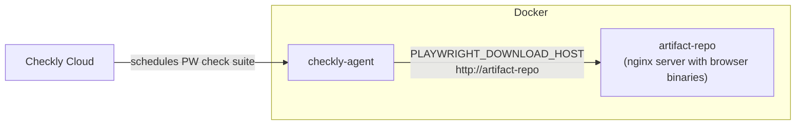

# Playwright Check Suite example: download browser binaries from a local artifact repository on a private location

This is an example of how to configure a Playwright Check Suite to download browser binaries from a local [artifact repository](https://playwright.dev/docs/browsers#download-from-artifact-repository), running from the same local machine as your private location.

Created mostly with Claude Code, reviewed by a human.

## Limitations

* This was tested on a MacOS ARM computer. Playwright installs different binaries based on the OS that the Private Location is running on, so if you're running on a different OS, you may need to install additional browser binaries for this to work.
* We're only downloading/using Chromium, for simplicity

## How does this work?



### Project structure

- `checkly.config.ts` — Checkly project config; defines the Playwright Check Suite
- `__checkly__/private-location.check.ts` — Private location construct
- `mirror-browsers.sh` — Downloads Playwright browser binaries into `artifact-repo/data/`
- `docker-compose.yml` — Runs the artifact repo (nginx) and Checkly Agent containers
- `artifact-repo/` 
    - `nginx/default.conf` — Nginx server config
    - `data/` — Mirrored browser zips, created by `mirror-browsers.sh` and served by nginx

## Getting started

You'll need:

- Docker & Docker Compose
- Node.js 18+

### 1. Install dependencies

```bash
npm install
```

### 2. Download Playwright browser binaries

These will be served by our artifact-repo Docker container whenever our PWCS requests it.

```bash
./mirror-browsers.sh
```

### 3. Create a Private Location in Checkly and grab the API key

This CLI project has a Private Location defined, so all you need to do is run:
```bash
npx checkly deploy
```

Then, [go to the deployed Private Location](https://app.checklyhq.com/accounts/private-locations) ("Location - Artifact Repo Example), create an API key, and save it.

Add that API key to the .env file. You can copy the .env.example as a template:
```bash
cp .env.example .env
```

### 4. Start your Docker containers

```bash
docker compose up -d
```

This starts:
- **artifact-repo** (nginx on port 8888) — serves the mirrored browser binaries
- **checkly-agent** — connects to Checkly Cloud, downloads browsers from `artifact-repo`

You can check to make sure the artifact-repo is up and running:

```bash
curl http://localhost:8888/health
curl http://localhost:8888/builds/  # should show directory listing
```

### Done

That's it! You can now do a test run of your PW check suite in Checkly.

If you watch the Docker logs while you run your check suite, you should see the browsers being downloaded.

```bash
docker compose logs -f checkly-agent
```

The artifact-repo logs should look like this:

```
[artifact-repo] [2026-03-26T22:31:14+00:00] | 200 | GET /builds/chromium/1208/chromium-linux-arm64.zip | 188304613 bytes | From 172.23.0.3 "Playwright/1.58.2 (arm64; ubuntu 24.04) node/22.14"

[artifact-repo] [2026-03-26T22:31:18+00:00] | 200 | GET /builds/ffmpeg/1011/ffmpeg-linux-arm64.zip | 1717234 bytes | From 172.23.0.3 "Playwright/1.58.2 (arm64; ubuntu 24.04) node/22.14"

[artifact-repo] [2026-03-26T22:31:18+00:00] | 200 | GET /builds/chromium/1208/chromium-headless-shell-linux-arm64.zip | 111562127 bytes | From 172.23.0.3 "Playwright/1.58.2 (arm64; ubuntu 24.04) node/22.14"
```
